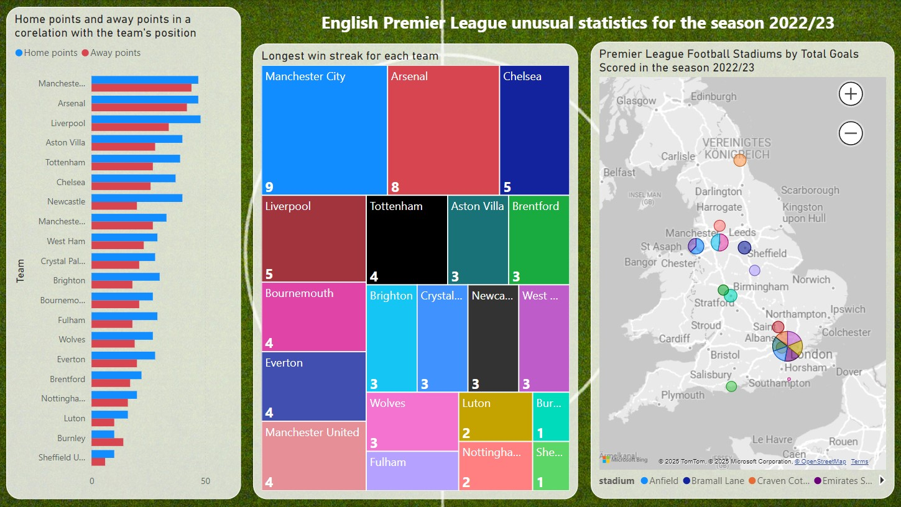

## Introduction

Goal of this project is to enchance my Data Engineering and Analytics skills. Data for this project is fetched from a [Sport API](https://dashboard.api-football.com/).

## Background

I love watching English Premier League and at some point I came up with an idea that it would be great to create a dataset using PostgreSQL by fetching data from some API. Football data also provides an excellent opportunity for analyse and visualisation.

## Tools I used

To create this project I worked with the following tools/technologies:

- **ETL** tools to extract the data from an API, transform it and load into a PostgreSQL database with subsequent visualisation using Power BI
- **REST** technology to communicate with an API
- **JSON** file format for storing the data before it would be transferred into a table
- **requests** python library for fetching the data from the API
- **SQLAlchemy** python library for transfering the data from JSON file to the table
- **pgAdmin** for managing the database, creating ERD diagram
- **Power BI** to create a report
- **ChatGPT** to help with fixing some errors and creating a complicated SQL-query
- **Bash** for interaction with OS, doing terminal based tasks and working with GitHub
- **Git** for version control

## Creating tables using PostgreSQL

I started with creating schemas for my future tables.

```sql
CREATE TABLE IF NOT EXISTS Teams (
    team_id SERIAL PRIMARY KEY,
    team_name VARCHAR(100) NOT NULL,
    city VARCHAR(100) NOT NULL,
    founded_year INT,
    stadium VARCHAR(100),
    manager VARCHAR(100)
);
```

ERD diagram of my tables correlation looks as follows (made using pgAdmin):


## Filling tables via fetching from an API

To fetch the data from the API python's requests library had been used.

```python
# Function to fetch data from a specific endpoint
def fetch_data(endpoint, params=None):
    response = requests.get(base_url + endpoint, headers=headers, params=params)
    if response.status_code == 200:
        return response.json()
    else:
        print(f"Failed to fetch data: {response.status_code}")
        return None
```

Response had been then saved as JSON file for further use.

To transfer the data from JSON file to the table I used python's SQLAlchemy library.
Firstly a mapping should be done. In this case I have been using imperative table definitions because I was going to use raw SQL queries to train these skills as well. Example of mapping is below:

```python
matches_table = Table(
    "matches", metadata,
    Column("match_id", Integer, primary_key=True, autoincrement=True),
    Column("home_team_id", Integer, ForeignKey("teams.team_id"), nullable=False),
    Column("away_team_id", Integer, ForeignKey("teams.team_id"), nullable=False),
    Column("match_date", Date),
    Column("stadium", String(100)),
    Column("home_score", Integer),
    Column("away_score", Integer),
    Column("result", String(10), CheckConstraint("result IN ('home', 'away', 'draw')"))
)
```

When mapping was ready time has come to transfer data from JSON to tables.

For example following code had been used to transfer data into a "Teams" table:

```python
from sqlalchemy import create_engine, MetaData, select
from sqlalchemy.orm import sessionmaker
import json
from api_settings import DATABASE_URL
from mapping import teams_table

# Database connection setup
engine = create_engine(DATABASE_URL)
Session = sessionmaker(bind=engine)
session = Session()

# Metadata for table definitions
metadata = MetaData()

# Check if a team exists and insert if not
def upsert_team(team_data):
    team_name = team_data['team']['name']
    city = team_data['venue']['city']
    founded_year = team_data['team']['founded']
    stadium = team_data['venue']['name']
    manager = None  # no manager info in this response

    # Query to check for existing team
    query = select(teams_table).where(teams_table.c.team_name == team_name)
    result = session.execute(query).fetchone()

    if result:
        print(f"Team '{team_name}' already exists in the database.")
    else:
        # Insert the new team
        insert_query = teams_table.insert().values(
            team_name=team_name,
            city=city,
            founded_year=founded_year,
            stadium=stadium,
            manager=manager
        )
        session.execute(insert_query)
        session.commit()
        print(f"Team '{team_name}' has been added to the database.")

# Load JSON data
with open('json_files/teams2023.json', 'r') as file:
    data = json.load(file)

# Loop through the teams and upsert into the database
for team_entry in data['response']:
    upsert_team(team_entry)

# Close session when done
session.close()
```

After all the data has been transfered into the tables it was time to write some SQL queries.

## SQL queries

To practice SQL-skills I came up with 4 queries: to find top scoring stadiums (where the most goals were scored), home standings table (how standings would have looked like if only home games count), away standings table (how standings would have looked like if only away games count) and longest winning streaks for each team.

For example, home standings query looks as follows:

```sql
SELECT
    t.team_name AS team,
    COUNT(*) AS home_matches_played,
    SUM(CASE WHEN m.result = 'home' THEN 1 ELSE 0 END) AS home_wins,
    SUM(CASE WHEN m.result = 'draw' THEN 1 ELSE 0 END) AS home_draws,
    SUM(CASE WHEN m.result = 'away' THEN 1 ELSE 0 END) AS home_losses,
    SUM(m.home_score) AS goals_scored_at_home,
    SUM(m.away_score) AS goals_conceded_at_home,
    SUM(
        CASE
            WHEN m.result = 'home' THEN 3
            WHEN m.result = 'draw' THEN 1
            ELSE 0
        END
    ) AS home_points
FROM Matches m
JOIN Teams t ON m.home_team_id = t.team_id
GROUP BY t.team_name
ORDER BY home_points DESC, goals_scored_at_home DESC;
```

Unfortunately, longest winning streaks for each team query was a bit too ambitious so I had to use ChatGPT to figure it out.

## Power BI report

To create map visualisations data adjustments in Power BI were neccesary. For example, to be able to create the map visuals: fetched city info was loaded in a inappropriate format and also naming needed to be adjusted since maps do not recognize them if there is additional information, such as "Wolverhampton, West Midlands", so it needed to be changed to just "Wolverhampton".

Finally I came up with the following visualisations:


