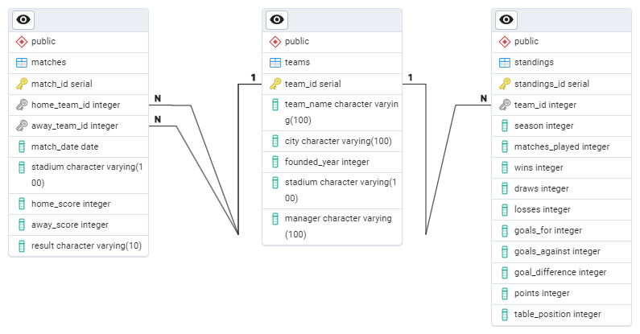

## Introduction

Goal of this project is to enchance my Data Engineering and Analytics skills. Data for this project is fetched from a [Sport API](https://dashboard.api-football.com/).

## Background

I love watching English Premier League and at some point I came up with an idea that it would be great to create a dataset using PostgreSQL by fetching data from some API. Football data provides an excellent opportunity for analyse and visualisation.

## Tools I used

To create this project I worked with following tools:

- **ETL**
- **REST**
- **pgAdmin** for managing the database, creating ERD diagram
- **Bash** for interaction with OS, doing terminal based tasks and working with GitHub
- **Git** for version control

## Creating tables using PostgreSQL

I started with creating schemas for my future tables.

```sql
CREATE TABLE IF NOT EXISTS Teams (
    team_id SERIAL PRIMARY KEY,
    team_name VARCHAR(100) NOT NULL,
    city VARCHAR(100) NOT NULL,
    founded_year INT,
    stadium VARCHAR(100),
    manager VARCHAR(100)
);
```

ERD diagram of my tables correlation looks as follows (made using pgAdmin):


